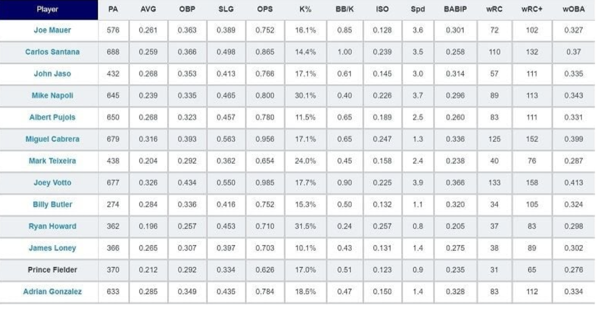

# Introduction

An overview of data processing and the NumPy library.

> We'll cover the following:
>
> - A. Data processing
> - B. NumPy

In this chapter, you'll learn how to perform data processing and manipulation using NumPy.

## A. Data processing

When asked about Google's model for success, Peter Norvig, the director of research at Google, famously stated,

> "We don't have better algorithms than anyone else; we just have more data."

Though probably an understatement (given the amount of talent employed at Google), the quote does provide a sense of just how vital data is to having successful outcomes.

People normally discuss the importance of data in the context of machine learning. No matter how sophisticated a machine learning model is, it will not perform well unless it has a reasonable amount of data to train on.  
 On the other hand, given a large and diverse set of training data, a good deep learning model will significantly outperform non-deep-learning algorithm.

However, data is not just limited to machine learning.  
 Companies use data to identify customer trends, political parties use data to determine which demographics they should target, sports teams use data to analyze players, etc.

The universal usage of data makes data processing, the act of converting raw data into a meaningful form, an essential skill to have.

## B. NumPy

Many scenarios involve mostly numeric datasets.  
 For example, medical data contains many numeric metrics, such as height, weight, and blood pressure.

Furthermore, the majority of neural networks use input data that is either numeric or has been converted to a numeric form.

When we deal with numeric data, the best Python library to use is NumPy.  
The NumPy library allows us to perform many operations on numeric data and convert the data to more usable forms.

    # import the NumPy library
    import numpy as np
    # Initializing a NumPy array
    arr = np.array([-1, 2, 5], dtype=np.float32)
    # Print the representation of the array
    print(repr(arr))
